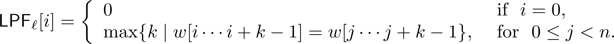
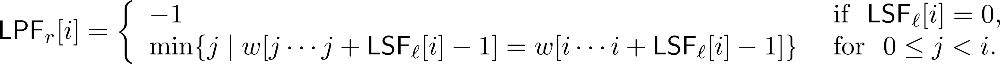
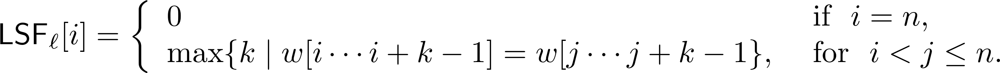
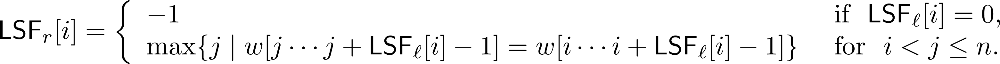
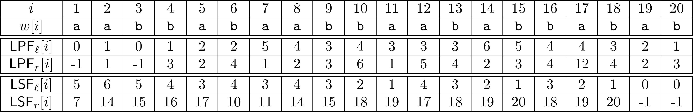

# lspf: Tool to compute Longest Successor and/or Previous Factor Array

This is an implementation of the linear-time algorithm by Crochemore and Ilie to find the Longest Previous Factor (LPF) Array using Suffix Array as published in the following:

> _Maxime Crochemore, Lucian Ilie_,
> **Computing Longest Previous Factor in linear time and applications**,
> Information Processing Letters,
> Volume 106, Issue 2,
> 2008,
> Pages 75-80,
> ISSN 0020-0190,
> [doi](https://doi.org/10.1016/j.ipl.2007.10.006.)
> [url](http://www.sciencedirect.com/science/article/pii/S0020019007002979)

In addition to the LPF Array of a string, this implementation produces the corresponding _Reference Array_ which indicates the index of the leftmost occurrence of the longest previous factor at each position. This is in contrast to the above publication where the algorithm gives an index of any of the previous occurrences. Compressed Suffix Tree ([SDSL Library](https://github.com/simongog/sdsl-lite/tree/d52aa9a71513d132e30c09491b5899af449ebb94)) has been used to achieve that.

Moreover, the Longest Successor Factor (LSF) Array is also produced which is implemented as a mirror image of the algorithm to create LPF Array. Accordingly, _Reference Array_ in this case provides the index of the rightmost occurrent of the longest successor factor at each position.

The arrays are verified against those produced by the brute-force algorithm. Consequently, verification stage is qudaratic-time even though computation is linear-time. Of course, verification can be disabled by simple modifications in the _main_ method (File: _lspfuser.cpp_ in _src_ folder). 

## Configuration: 
There are three modes of operations--DETAILS, RANDOM, EXHAUSTIV--which respectively correspond to testing either the user-specified strings or random strings or all possible binary strings up to a certain length. Specifically,
 * _DETAILS_: Check one or more strings by adding to the list <*text_list*>.
  
 * _RANDOM_: Test <*cNum_Strings*> number of random strings from the alphabet <*cAlphabet*> of lengths varying up to <*cMax_len*>.
 
 * _EXHAUSTIVE_: Test all binary strings of length up to <*max_len*>.

 ### Choosing and Setting-up the mode: 
 The configuration macros and variables have been defined in the file _lspfuser.cpp_ in _src_ folder. 
 Please choose the suitable operating mode by uncommenting/commenting the corresponding macro and set-up the corresponding variables for that mode with the values of your choice. By default, _DETAILS_ is selected with two toy strings: "abbaabbbaaabab", "ananas", and "aabbabaabbaababbabab".

 After changing (as needed) the mode and configuration variables, the source-code can be compiled.
 
 ### Compilation: 
Please follow the instructions given in file `INSTALL.md`

## Output:

* For each string, the following results are displayed on the standard output (usually terminal):
  + In _DETAILS_ mode, 
    - The string itself.
    - All the arrays: Length (denoted <*lspf\_l*>) and Reference (denoted <*lspf\_r*>) arrays for both - LPF and LSF. 
    - Verification results give the number of errors (which should be 0). An error is a mismatch at any position in any of the arrays produced by the algorithm and those by brute force. For each error, its location/index (denoted <*i*>), value calculated by the algorithm (denoted <*calc*>), value calculated by the algorithm (denoted <*naive*>) are printed and number of errors is increased by 1.
  + In _RANDOM_ and _EXHAUSTIVE_ modes, only the text and the verification results are printed.

* If there is an error in one of the strings, tool will terminate and will not test the remaining strings.

In addition, a <*stat.txt*> file is generated in the working (i.e. tool) directory. Each row/line stores the stats-record for each string tested. A stats-record comprise of the length (denoted <*n*>), time taken for computation of the LPF arrays (denoted <*lpf-time*> in microseconds), time taken for computation of the LSF arrays (denoted <*lsf-time*> in microseconds); each tab-separated. Time taken does not include the pre-processing stage (construction and manipulation of the suffix-tree).


## Usage: 
Run the tool by the following command from inside the tool-directory.
```
./bin/luf 
```

## Definitions: 
Given a string $w$, we define the following:
* The longest previous factor of $w$ starting at position $i$, is the longest factor of $w$ that occurs at $i$ and has at least one other occurrence in the prefix $w[1 .. i-1]$. The _longest previous factor (LPF) array_ (denoted by _LPF\_l_) gives for each position $i$ in $w$, the length of the longest factor starting both at position $i$ and at another position $i > j$.
* The _LPF-Reference Array_, denoted by _LPF\_r_, specifies for each position $i$ of $w$, the _reference_ of the longest previous factor at $i$. The _reference_ of $i$ is defined as the position $j$ of the first occurrence of the $w[i .. i+ _LSF\_l_[i]-1]$ in $w$.

* The longest successor factor of $w$ starting at position $i$, is the longest factor of $w$ that occurs at $i$ and has at least one other occurrence in the suffix $w[i+1 .. n]$. The _longest successor factor (LSF) array_ (denoted by _LSF\_l_) gives for each position $i$ in $w$, the length of the longest factor starting both at position $i$ and at another position $j>i$.
* The _LSF-Reference Array_, denoted by _LSF\_r_, specifies for each position $i$ of $w$, the _reference_ of the longest successor factor at $i$. The _reference_ of $i$ is defined as the position $j$ of the last occurrence of the $w[i .. i+ _LSF\_l_[i]-1]$ in $w$.


More formally, for a string $w$ of length $n$, the arrays (one-based index) can be specified as follows:








## Examples: 


## External Tools: 
[SDSL Library](https://github.com/simongog/sdsl-lite/tree/d52aa9a71513d132e30c09491b5899af449ebb94) is used for compressed suffix tree (whose underlying data structure is compressed suffix array).


